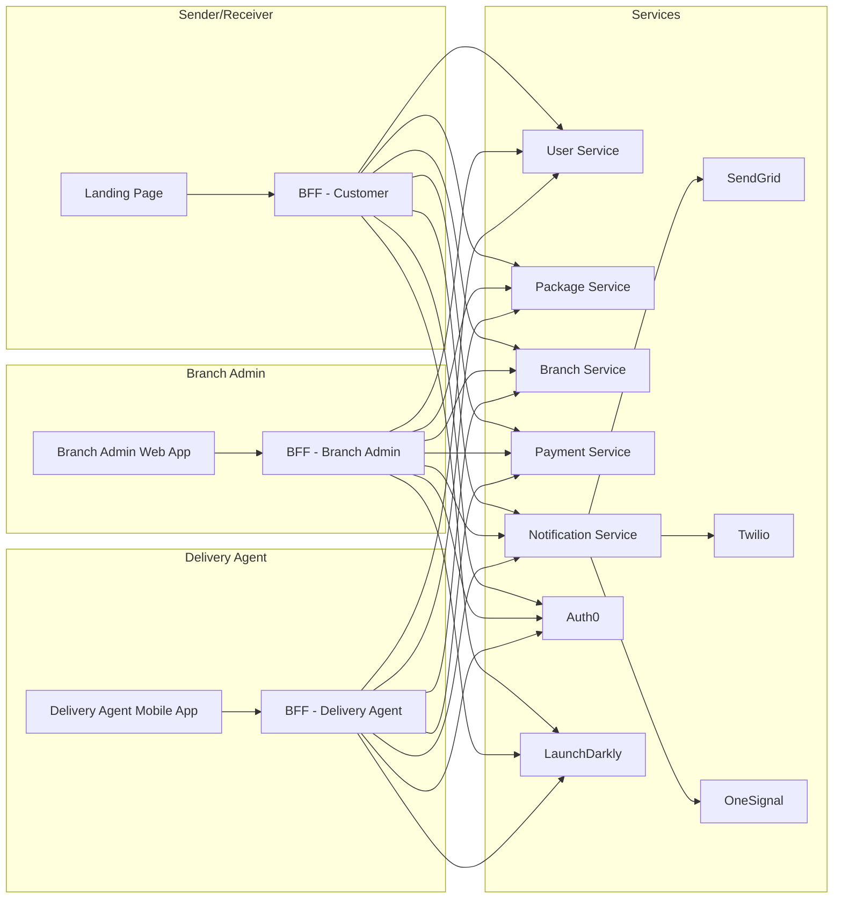

# Nallamale Courier Service

__This is imaginary courier service that is used to demonstrate the use of the system design principles__

Nallamale company is a startup that is into courier services. They have management team, operations team,
sales and marketing team, engineering team and delivery agents. 
They have Engineering team with;

- 5 developers
- 2 QA engineers
- 1 DevOps engineer
- 1 Business Analyst
- 1 Project Manager
- 1 tech lead
- UI/UX designer

I'm trying to apply stuffs that I learned from the book,

- [Software Architecture and Decision Making](https://ptgmedia.pearsoncmg.com/images/9780138249731/samplepages/9780138249731_Sample.pdf) by Srinath Perera.

## Requirements

## Branches

- Packages should be able to be entered into the system from the branch
- Branch should be able to register delivery agents
- Branch should be able to assign a package to a sender
- Branch should be able to track all packages
- Branch should be able to update the status/location of a package/packages

## Senders/Receivers

- Senders/Receivers should be able to track their packages

## Delivery Agents

- Delivery agents should be able to update the status/location of a package
- Delivery agents should be able to view all packages assigned to them

## How this unreal company works

1. BA will get the requirements from the management team, operations team and delivery agents for each quarter.
2. BA will then create a document with all the requirements and review it with the engineering team.
3. BA will prioritize the requirements with the help of the management team and operations team.
4. BA will share the requirements with the engineering team.
5. Tech lead will create a document with all the design details and share it with the engineering team.
6. Project manager will create epics and stories for design and share it with the engineering team.
7. UI/UX designer will create the UI/UX design for the epics and stories.
8. Tech lead will break down the design into tasks and estimate the time required to complete each task with the help of the engineering team under the epics and stories.
9. Project manager will assign the tasks to the engineering team.
10. Engineering team will start working on the tasks.
11. QA team will start writing test cases for the tasks.
12. QA team will start writing automation scripts for the tasks.
14. After the tasks are completed, DevOps engineer will deploy the code to the test environment.
15. QA team will test the code in the test environment.
!6. After the code is tested, DevOps engineer will deploy the code to the production environment.

## Tools and Technologies

### Project Management

- Jira
- Confluence

### Design

- Excalidraw
- Figma

### Development

#### Frontend

- Next.js
- Tailwind CSS

### Backend

**Languages**:
- Javascript/Golang/.NET

**Database**:
- MongoDB

We chose MongoDB because rapidly changing requirements and it is easy to scale.

**Backend Frameworks**:
- Javascript: Express.js
- Golang: Gin
- .NET: ASP.NET Core

**Architecture**:
- Microservices

Backend will be developed using microservices architecture because,
- We can scale, deploy and maintain each service independently
- We can use different tech stacks for each service

### Infrastructure

**PubSub**: Kafka

**Caching**: Redis

**Tracing and Observability**: OpenTelemetry and Jaeger/Grafana

**CI**: GitHub Actions

**CD**: ArgoCD

**Secrets Management**: HashiCorp Vault

**K8s**: EKS

## Design

### High Level Design

We need frontends for the following users;
- Branch - Web app
- Sender/Receiver - Web app
- Delivery Agent - Mobile app

### Services and APIs

CRUD services:
- User Service (Sender/Receiver/Delivery Agent/Branch Admin)
= Package Service
- Branch Service

Handle payments:
- Payment Service

Handle notifications:
- Notification Service

Aggregate services for each frontend:
- BFF

IAM:
- Auth0

Feature flags:
- LaunchDarkly

Email service:
- SendGrid

SMS service:
- Twilio

Push notification service:
- OneSignal

### Database Design

#### User Service

__User (Sender/Receiver) Model__

```json
{
    "_id": "1",
    "name": "John Doe",
    "email": "john@mail.com",
    "address": "123, Main Street, New York, NY",
    "phone": ["+1 123 456 7890", "+1 123 456 7891"],
    "password": {
        "hash": "1234567890",
        "salt": "1234567890"
    },
    "createdAt": "2021-09-01T00:00:00Z",
    "updatedAt": "2021-09-01T00:00:00Z"
}
```

__Delivery Agent Model__

```json
{
    "_id": "1",
    "name": "John Doe",
    "email": "john@mail.com",
    "address": "123, Main Street, New York, NY",
    "phone": ["+1 123 456 7890", "+1 123 456 7891"],
    "NIC": "123456789V",
    "branch": "1",
    "password": {
        "hash": "1234567890",
        "salt": "1234567890"
    },
    "createdAt": "2021-09-01T00:00:00Z",
    "updatedAt": "2021-09-01T00:00:00Z"
}
```

__Branch Admin Model__

```json
{
    "_id": "1",
    "name": "John Doe",
    "email": "john.doe@mail.com",
    "address": "123, Main Street, New York, NY",
    "phone": ["+1 123 456 7890", "+1 123 456 7891"],
    "NIC": "123456789V",
    "branch": "1",
    "password": {
        "hash": "1234567890",
        "salt": "1234567890"
    },
    "createdAt": "2021-09-01T00:00:00Z",
    "updatedAt": "2021-09-01T00:00:00Z"
}
```

#### Package Service

__Package Model__

```json
{
    "_id": "1",
    "sender": {
        "id": "1",
        "name": "John Doe",
        "address": "123, Main Street, New York, NY",
        "phone": ["+1 123 456 7890", "+1 123 456 7891"]
    },
    "receiver": {
        "id": "1",
        "name": "John Doe",
        "address": "123, Main Street, New York, NY",
        "phone": ["+1 123 456 7890", "+1 123 456 7891"]
    },
    "deliveryAgent": "1",
    "statusHistory": [
        {
            "status": "pending",
            "location": "New York Branch",
            "createdAt": "2021-09-01T00:00:00Z"
        }
    ],
    "createdAt": "2021-09-01T00:00:00Z",
    "updatedAt": "2021-09-01T00:00:00Z"
}
```

#### Branch Service

__Branch Model__

```json
{
    "_id": "1",
    "name": "New York Branch",
    "address": "123, Main Street, New York, NY",
    "phone": ["+1 123 456 7890", "+1 123 456 7891"],
    "createdAt": "2021-09-01T00:00:00Z",
    "updatedAt": "2021-09-01T00:00:00Z"
}
```

### Architecture Diagram



## API Design

### User Service

__Login__

```http
POST {{url}}/api/v1/users/login
Content-Type: application/json

{
    "email": "john@mail.com"
    "password": "1234567890"
}
```

__Register__ <!-- pass type of user ex: client, admin and delivery -->

```http
POST {{url}}/api/v1/users/register
Content-Type: application/json

{
    "name": "John Doe",
    "email": "john@mail.com",
    "address": "123, Main Street, New York, NY",
    "phone": ["+1 123 456 7890", "+1 123 456 7891"],
    "password": "1234567890"
}
```

__Get User__

```http
GET {{url}}/api/v1/users/{{userId}}
```

__Update User__ <!-- pass type of user ex: client, admin and delivery -->

```http
PUT {{url}}/api/v1/users/{{userId}}
Content-Type: application/json
Authorization: Bearer {{token}}

{
    "name": "John Doe",
    "email": "john@mail.com",
    "address": "123, Main Street, New York, NY",
    "phone": ["+1 123 456 7890", "+1 123 456 7891"],
    "password": "1234567890"
}
```

__Delete User__

```http
DELETE {{url}}/api/v1/users/{{userId}}
Authorization: Bearer {{token}}
```

__Forgot Password__

```http
POST {{url}}/api/v1/users/forgot-password
Content-Type: application/json

{
    "email": "john@mail.com"
}
```


### Package Service

__Create Package__ <!-- have to link with branch, client, delivery agent -->

```http
POST {{url}}/api/v1/packages
Content-Type: application/json
Authorization: Bearer {{token}}

{
    "sender": {
        "id": "1",
        "name": "John Doe",
        "address": "123, Main Street, New York, NY",
        "phone": ["+1 123 456 7890", "+1 123 456 7891"]
    },
    "receiver": {
        "id": "1",
        "name": "John Doe",
        "address": "123, Main Street, New York, NY",
        "phone": ["+1 123 456 7890", "+1 123 456 7891"]
    },
    "deliveryAgent": "1",
    "statusHistory": [
        {
            "status": "pending",
            "location": "New York Branch",
            "createdAt": "2021-09-01T00:00:00Z"
        }
    ]
}
```

__Get Package__

```http
GET {{url}}/api/v1/packages/{{packageId}}
```

__Update Package__

```http
PUT {{url}}/api/v1/packages/{{packageId}}
Content-Type: application/json
Authorization: Bearer {{token}}

{
    "sender": {
        "id": "1",
        "name": "John Doe",
        "address": "123, Main Street, New York, NY",
        "phone": ["+1 123 456 7890", "+1 123 456 7891"]
    },
    "receiver": {
        "id": "1",
        "name": "John Doe",
        "address": "123, Main Street, New York, NY",
        "phone": ["+1 123 456 7890", "+1 123 456 7891"]
    },
    "deliveryAgent": "1",
    "statusHistory": [
        {
            "status": "pending",
            "location": "New York Branch",
            "createdAt": "2021-09-01T00:00:00Z"
        }
    ]
}
```

__Delete Package__

```http
DELETE {{url}}/api/v1/packages/{{packageId}}
Authorization: Bearer {{token}}
```

__Get Packages__

```http
GET {{url}}/api/v1/packages
Authorization: Bearer {{token}}
```

### Branch Service

__Create Branch__

```http
POST {{url}}/api/v1/branches
Content-Type: application/json
Authorization: Bearer {{token}}

{
    "name": "New York Branch",
    "address": "123, Main Street, New York, NY",
    "phone": ["+1 123 456 7890", "+1 123 456 7891"]
}
```

__Get Branch__

```http
GET {{url}}/api/v1/branches/{{branchId}}
```

__Update Branch__

```http
PUT {{url}}/api/v1/branches/{{branchId}}
Content-Type: application/json
Authorization: Bearer {{token}}

{
    "name": "New York Branch",
    "address": "123, Main Street, New York, NY",
    "phone": ["+1 123 456 7890", "+1 123 456 7891"]
}
```

__Delete Branch__

```http
DELETE {{url}}/api/v1/branches/{{branchId}}
Authorization: Bearer {{token}}
```

__Get Branches__

```http
GET {{url}}/api/v1/branches
Content-Type: application/json
Authorization: Bearer {{token}}
```
